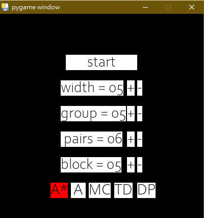
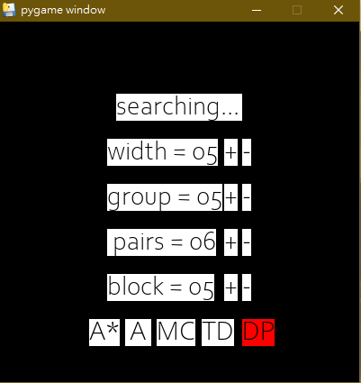
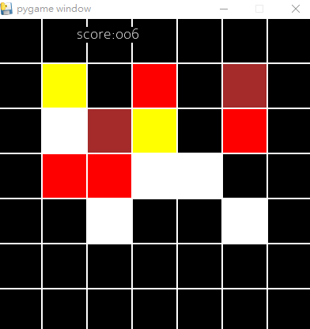

# Search Algorithms

This project implemented four search algorithms, including A, Dynamic programming, Monte Carlo Search and Temperal difference, and use a simple game Lianliankan as a testbed to analyze their performance. 

 #### Usage

Download game.exe at GoogleDriver or [Baidu](https://pan.baidu.com/s/1Nif2dIF6aIpOGwxuirGI4A)(password: llgq) and you can play the game

Please refer to the appendix (at the end of the `Readme.md`) for details about the game engine and UI. 

#### Code

 Please refer to `./code/core_logic.py` for the implementation of the four algorithms and check `./code/with_ui.py` for details about the implementation of the game engine.

#### Analysis

We analyze the connection and difference between four algorithm in the following report. Please check Chapter `算法` for more details.

## 概述

$A^*$算法是广为人知的搜索算法，能够在确保最优性的前提下极大化搜索速度，但是它的启发函数过度依赖先验知识，没办法用于通用场景，且一昧追求最优解将导致无法求解大规模问题。而强化学习则能够从历史数据中学习，能够在缺乏先验知识的情况下，快速的找到近似最优解。本文以连连看项目为基础，拿搜索算法与基于价值的强化学习方法做比较，探讨他们之间的异同，并试图在最优性与快速性间取得平衡，本文主要贡献如下

* 实现连连看游戏的核心逻辑与UI界面
* 实现$A^*$算法，并验证能正确解决$7\times 7$连连看问题
* 以动态规划算法(DP)算出真实价值，比较启发函数(价值函数)与分支因子的关系
* 实现蒙特卡洛(MC)与时序差分(TD)算法，并验证此算法有求解出大规模问题近似解的能力
* 探讨价值函数初始条件对算法性能的影响

## 算法

### A star

$A^*$算法是一致代价搜索的特例，他的核心思想是维护优先级队列，并按照$f(s)=g(s)+h(s)$的顺序依次拓展节点。其中$g(s)$是从起始状态到当前状态所获得的奖励，启发函数$h(s)$则预估了从当前状态到最终状态的预期收益。由可采纳性质可知，当$h(s)$相对于真实价值函数$V^*(s)$总是乐观估计时，树搜索$A^*$算法具有最优性。另一方面，当$h(s)$与$V^*(s)$越接近，搜索的分支因子越小、能更快求解。此外，当$h(s)=0$时，$A^*$算法退化为一致代价搜索算法。

由上文可知启发函数的选取对算法整体性能有决定性的影响，以下针对连连看游戏设计专用启发函数。首先定义松弛问题，假设不同类之间的方块互不可见，且所有类均可无视障碍物。此时，可以发现位于同行同列的一对方块均可以在零次转向内消除、位于不同行列的一对方块至多需要一次转向也能消除。

### 动态规划

动态规划是宽度优先搜索的特例，每次更新时都需要遍历所有子节点的值，并选取其中最优点作为目标价值。利用动态规划方法求取$Q$函数的公式如式一所示

$$ Q(s,a) = \sum_{s'} \pi(s'|s,a) [r(s,a,s') + \underset{a'}{max}Q(s',a')] \tag{1} $$

利用动态规划方法自底向上求解，并保存局部计算结果能够避免计算重复子问题，虽然与宽度优先算法相同需要遍历所有状态空间，但可以大幅降低求解时间。利用此性质，我们在求取所有真实价值函数$V^*(s)$时便是使用动态规划算法。(此处为了求解$Q^*(s,a)$不构建记录表、实现的其实是递归搜索)

### 蒙特卡洛

蒙特卡洛算法是深度优先算法的一种变形，当它走到最终节点时，不选择回溯递归回上一层继续搜索，而是直接回到起始状态开始全新的回合。此外，蒙特卡洛需要维护一个价值函数表，每次移动前在价值函数表中查询所有可能动作的估计价值，选取其中最高的，并在每个回合结束时更新价值函数表，更新公式如式二所示

$$ Q(s_t,a_t) \leftarrow Q(s_t,a_t) + \eta[\sum_{\tau=t}^\infty\gamma^{\tau-t}r_{\tau}-Q(s_t,a_t)] \tag{2} $$

其中$\gamma$是衰减因子控制未来收益对当前价值的影响、$\eta$代表学习率控制更新速度。每次选取动作时，采用$a^*=\underset{a}{argmaxQ}(s,a)$移动，并采用$\epsilon-greedy$的方法控制探索与利用比率。$Q$函数是目标函数$E_{\pi_{\epsilon-greedy}}[\sum_{\tau=t}^\infty\gamma^{\tau-t}r_{\tau}]$的无偏估计，随着时间能够收敛到目标函数。由于MC记录的轨迹过长，最终得到的$Q$函数会有较大的方差，且必须使用在线的方式学习，否则轻微的策略偏差都将对价值函数的学习带来灾难性的影响。 

### 时序差分

时序差分的核心思想是增加$Q$函数更新的频率，每与环境交互一步就对$Q$函数作一次更新，更新公式如式三

$$ Q(s_t,a_t) \leftarrow Q(s_t,a_t) + \eta[r_t+\gamma\underset{a'}{max}Q(s_{t+1},a')-Q(s_t,a_t)] \tag{3} $$ 

$TD$算法利用自举的方式迭代更新$Q$函数，与上述$MC$方法具有相同的目标函数，但由于自举查询时使用自身有偏差的估计值作为目标函数，因此最终结果会是有偏的、但有较低的方差。此外，$TD(0)$由于是单步更新，偏离原策略时不会引入误差，因此可以使用off-policy的算法更新，提升数据利用率。(本文只实现了on-policy的$TD(0)$算法)

### 算法联系

上图展示了四种算法的相对关系，落在光谱右方的算法更新时考虑更多的子节点、落在光谱下方的算法更新时考虑更深层子孙的信息。以下一一对比四个算法优劣

* TD与MC: TD算法更新较快、数据利用率高、但有偏差。MC算法更新慢、无偏但有高方差
* TD与DP: 在基于价值的强化学习方法中TD更新如上文所示，只使用argmax的动作来更新，是没有办法往光谱右方靠的(如果采样了两个动作，较差的动作对更新公式没有影响)。但在引入AC架构后，更新的Bellmen方程变为对策略回报求取期望的形式(即$E_\pi(\cdot)$)，此时若增加搜索的宽度，能够减少训练时的方差。
* MC与BFS: 如上文中所提及: MC是深搜的变形、$A^*$是广搜(一致代价)的变形。其中，MC的价值函数与$A$算法的启发函数具有相同的物理意义、且两者对启发函数都没有严格的限制(如可采纳性等)，但这两种算法却截然不同，具体体现在MC拓展节点时只考虑价值函数，而$A$算法拓展节点考虑了启发函数与当前已有路径代价。仔细思考后发现，MC因为是深度优先、拓展的节点都落在同一层(具有相同的已有路径代价)，因此MC其实可以看作$A$算法的退化。如果放宽此限制，使得MC与$A$算法具有相同的拓展节点方式，在这样的方法下训练有以下几点好处。第一，更容易找到价值函数$Q$下的最优策略，而不会陷入局部最优(参考$A^*$算法)，第二，增加采样宽度能有效降低训练时的方差(参考DP部份)，第三，这样类似回溯搜索的过程能减少对初始节点的利用次数，增加对未知节点的探索(如同First return, then explore论文般的探索功能)

## 实验

#### 连连看(限制转向次数)

> 在一个 n$\times$m 的棋盘中，散落着 2p 个图案，这些图案共有g类，此外存在b个障碍物。相同的两个图案可以进行消除。在基本消除规则下，设计搜索算法，尽可能多地消除棋盘中的图案，并给出求解过程。

此处使用$A^*$与h=0的$A$算法(此处令A算法的h函数恒为零)解决基础连连看问题，分别在5$\times$5、6$\times$6、7$\times$7等三个棋盘上进行测试，每次使用10个seed取平均，得到的结果如下表所示 ( 其中$7\times 7$棋盘使用A算法无法在有限时间内求出最优解 )。可以发现在加入启发函数后，搜索时间有显著的下降。并且两个算法结果相同、都是最优解。

| 搜索时间(秒) |      |      |       |
| ------------ | --------------------- | --------------------- | ---------------------- |
| 参数         | (n=5,m=5,g=5,p=6,b=5) | (n=6,m=6,g=6,p=9,b=9) | (n=7,m=7,g=7,p=12,b=0) |

#### 连连看(最少转向次数)

> 在基本消除规则的基础上，允许转向超过2次的连接，转向次数越多，则代价越大。请设计搜索算法，用尽可能少的转向次数来对棋盘中的图案进行消除，并给出求解过程。

与第一部份使用相同算法、相同实验设定，得到数据如下表所示( 其中$7\times 7$棋盘使用A算法无法在有限时间内求出最优解 )。由于此处分支因子更高，因此使用启发函数对性能有更大的提升。

| 搜索时间(秒) |      |      |  |
| ------------ | --------------------- | --------------------- | ---------------------------------------- |
| 参数         | (n=5,m=5,g=5,p=6,b=5) | (n=6,m=6,g=6,p=9,b=9) | (n=7,m=7,g=7,p=12,b=5)                   |

#### 启发函数与性能

接下来我们在$5\times 5$的棋盘上，跑3个seed来验证启发函数对性能的影响。此处利用动态规划方法得到真实价值函数，并与$A^*$算法中的启发函数做比较，如下表左图所示。发现启发函数是对于真实价值的乐观估计，因此分布明显偏左。

此外，使用相同设定，我们探讨了启发函数与分支因子的关系。我们使用使用新的启发函数$h_\alpha(s)=\alpha h(s) + (1-\alpha) V^*(s)$，由$\alpha$因子控制启发函数与真值的差值，经过实验发现启发函数与真值有较大偏离时，搜索步数越大，有近似线性关系。此外，这里需要说明的是，当所有启发函数同加一个常数时对最终性能完全没有影响。

|  |  |
| :---------------------------------------------------: | :---------------------------------------------------: |
|          横轴代表价值、纵轴代表取值为n的个数          |        横轴代表$\alpha$、纵轴代表搜索耗的步数         |
|         **启发函数(橘)与真实价值(蓝)的分布**          |             **启发函数与搜索步数的关系**              |

#### MC与TD性能

首先验证MC与TD算法具有逼近真实价值函数的能力，此处给出两种算法训练曲线，其中损失函数定义为$Loss=(V^*(s)-V(s))^2$，结果如下表所示。值得注意的是，此处使用的是表格形式的价值估计函数，没有使用参数$\theta$对价值函数做逼近，其好处是能避免估计时引入的误差，坏处是没法对状态进行抽象提升相似状态间的信息共享。

|  |  |
| :---------------------------------------------------: | :---------------------------------------------------: |
|         横轴代表迭代轮数、纵轴代表损失函数值          |         横轴代表迭代轮数、纵轴代表损失函数值          |
|                **MC价值函数训练过程**                 |                **TD价值函数训练过程**                 |

接下来验证MC与TD方法具有求解大规模问题近似解的能力，我们使用$20\times20$地图验证算法性能。此处给出测试路径代价-迭代次数曲线，由下表所示。虽然无法定量分析与最优解的差距，但由曲线是单调收敛的可以说明，MC与TD算法所得的解是近似最优解。

|  |  |
| :-------------------------------------------------------: | :-------------------------------------------------------: |
|      横轴代表迭代步数(千步)、纵轴代表测试时路径代价       |      横轴代表迭代步数(千步)、纵轴代表测试时路径代价       |
|                  **MC价值函数训练过程**                   |                  **TD价值函数训练过程**                   |

## 初始条件

藉由$7\times 7$棋盘验证价值函数初始值对最终性能的影响，结果如下表所示。可以发现当初始值是悲观估计时，会有更好的性能。我认为可以从两方面分析初始值对最终性能的影响

第一，若价值函数初始值选择高于平均的数时，算法对于没看过的状态会更有意愿探索，在稀疏场景下有利于算法收敛，但是这样的优化技巧只适用于静态场景。此外，对于基于价值的强化学习算法来说，由于每次更新涉及到max的计算，因此整体而言，对于价值函数会有高估的倾向，例如Double network的提出就是为了解决这个问题。而如果我们将价值函数初始化的过为乐观，那么将会加剧这样的现象，最终导致值函数偏离真值，影响算法性能。回到连连看问题，我认为因为连连看并非稀疏奖励问题，因此第二个因素更为重要、更悲观的初始值会有更好的效果。

|  |  |  |  |
| :---------------------------------------------------------: | :----------------------------------------------------------: | :---------------------------------------------------------: | :---------------------------------------------------------: |
|                        **初始值=0**                         |                         **初始值=5**                         |                        **初始值=10**                        |                        **初始值=20**                        |

## 结论

本文从$A^*$、$DP$、$MC$、$TD$等四个算法出发，讨论搜索与强化学习之间的关系。并使用连连看游戏作为测试环境，验证各项算法的性能。此外，针对启发函数我们进一步讨论其误差与分支因子间的关系。并且，针对$MC$与$TD$算法，我们验证了他们求解大规模问题近似解的能力。最终，我们分析了初始价值函数值对性能的影响。整体而言，本文重新整理了搜索算法与强化学习方法间的异同，并藉由连连看环境验证了一些现象。

## 附录

* UI界面使用说明

  |  |  |  |
  | :----------------------------------------------------------: | :----------------------------------------------------------: | :----------------------------------------------------------: |
  |                           开始界面                           |                           等待界面                           |                         显示结果界面                         |

  * 在开始界面中用户可以设置棋盘大小(=width$\times$width)、类型数量(group$\leq 9$)、对数(pairs)、障碍物数(block)。此外可以在五个算法中选择一个使用

    > 建议: $A^*$算法pairs不超过10、DP算法pairs不超过6、MC与TD对pairs没有限制

  * 按下start按钮后开始搜索、进入等待界面，请耐心等候

  * 搜索完毕后，进入显示结果界面，上方score代表目前的转向次数、中间代表当前棋盘，会循环播放结果，重设参数需要重启程序

  * 程序采用确定性环境(统一设定seed=0)，当参数固定时初始棋盘相同，以方便比较各算法的能力

  * 此处的A算法代表当启发函数等于0的一致代价搜索算法

  * 需要确保，否则程序出错 $pairs\times 2+block\leq width^2$

* 代码结构

  * UI类: `init` 掌管欢迎页面、`DrawRec`控制游戏回放界面
  * Board类: 对于游戏模拟器的抽象实现
  * Node类: 对搜索算法所需工具的支持
  * 四个算法函数: 搜索函数的核心逻辑
  * 调试时可以使用core_logic.py、增加速度